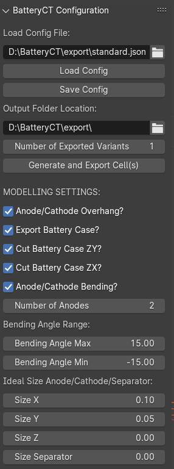

# BatteryCT
SIMULATION OF BATTERY CT-SCANNING FOR ELECTRICAL VEHICLES

The detection of production flaws in battery cells without causing any damage is crucial for ensuring quality control. Computed tomography (CT) emerges as a promising solution for non-destructive defect detection. However, efficient defect detection relies heavily on accurately identifying defects from captured CT images. This necessitates a large amount of data for Artificial Intelligence (AI) training and development.
Obtaining real scans of cells for this purpose is both laborious and expensive. Simulative data generation presents an alternative approach to tackle this challenge. This work outlines the concept of simulative data generation for the efficient detection of defects in cell production using CT imaging. By creating synthetic data, and simulate CT images based on the synthetic data, the concept aims to provide a cost-effective and practical solution for training and developing defect detection algorithms.

<object data="https://github.com/Fbisinger/BatteryCT/blob/master/doc/MSYS_Paper_BISINGER_GRENZ_SCHOPF.pdf" type="application/pdf" width="700px" height="700px">
    <embed src="https://github.com/Fbisinger/BatteryCT/blob/master/doc/MSYS_Paper_BISINGER_GRENZ_SCHOPF.pdf">
        
You can download or view our paper here: <a href="https://github.com/Fbisinger/BatteryCT/blob/master/doc/MSYS_Paper_BISINGER_GRENZ_SCHOPF.pdf">SIMULATION OF BATTERY CT-SCANNING FOR ELECTRICAL VEHICLES PDF</a>.

    </embed>
</object>

BLENDER UI

The project is based on [Blender](https://www.blender.org/) and its Python API. The sourcecode provided in [src](https://github.com/Fbisinger/BatteryCT/blob/master/src) creates a custom UI panel in Blender which can be utilised to generate custom battery 3d-geometrys. A small part of the panel is displayed in the screenshot below.

BatteryCT 2024 F.Bisinger, E.Grenz, I.Schopf at University of Applied Sciences Karlsruhe (HKA) at the MSYS Lab under supervision of Prof. Dr.-Ing. Martin Simon.